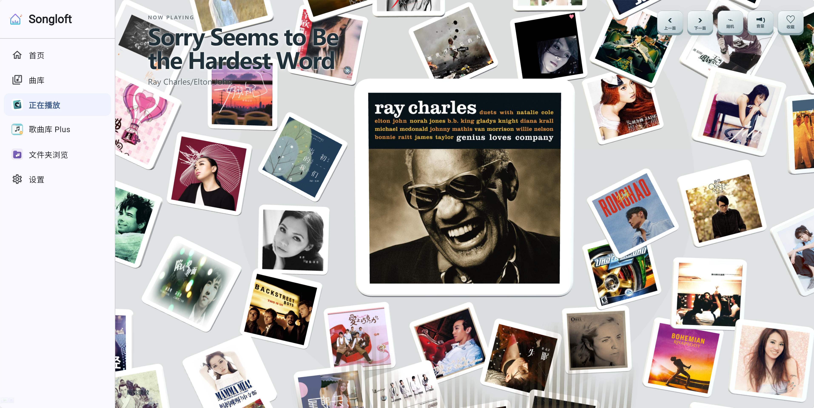
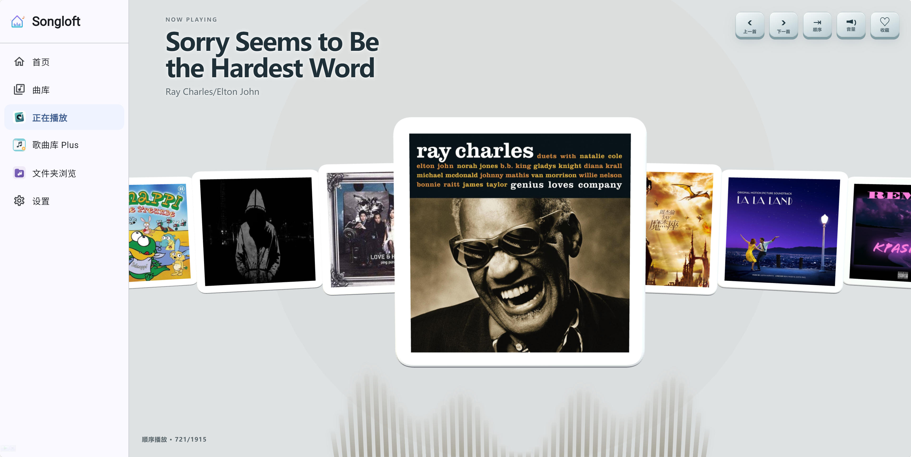
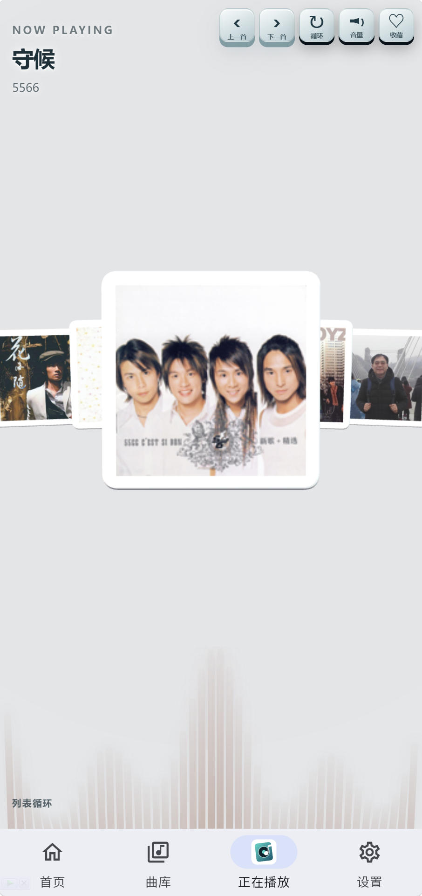
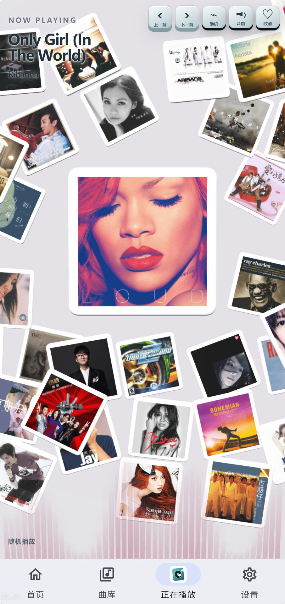

# 🎵 Songloft 正在播放

Songloft 正在播放是一款面向 [Songloft](https://github.com/songloft-org/songloft) 的沉浸式 3D 专辑卡片播放扩展。它用 3D 卡片的方式显示正在播放的歌曲与歌单，背景与底部律动颜色跟随当前封面的主题色，并自动适配 Songloft 的深色、浅色主题以及 PC、移动端视图。

> 🤖 本插件由 AI 生成。欢迎通过 GitHub Issues 反馈使用中遇到的问题与改进建议。

## 🔗 关于 Songloft

[Songloft](https://github.com/songloft-org/songloft) 是本插件所依赖的音乐服务项目。本插件基于 Songloft 提供的插件能力开发，是独立维护的扩展项目，并非 Songloft 主程序的内置组件。

- 上游项目：[songloft-org/songloft](https://github.com/songloft-org/songloft)
- 最低兼容版本：Songloft v2.10.0，且需要包含 Player API 更新
- 播放器始终是播放状态的唯一数据源，扩展不维护独立的播放队列或播放状态
- 依赖 `getState`、`onStateChange`、`play`、`togglePlay`、`prev`、`next` 与 `setPlayMode`
- 支持现代 Chromium WebView、桌面端鼠标与移动端触摸操作

## ✨ 功能亮点

### 3D 专辑卡片

- 将播放队列呈现为带封面、厚度和翻转动画的 3D 专辑卡片。
- 常规模式最多按需加载 30 张卡片，随机模式最多按需加载 50 张，避免长队列一次性创建全部 3D 资源。

### 播放控制

- 支持顺序播放、列表循环和随机播放三种空间布局。
- 左右拖动卡片切歌；随机模式同样支持拖动切换上一首或下一首。
- 点击当前卡片暂停或继续，暂停时卡片翻转并显示暂停符号。
- 右上角提供上一首、下一首、播放模式、音量和收藏实体控制组。
- 收藏状态显示红心，并与 Songloft 内置收藏歌单同步。

### 主题与适配

- 背景和底部律动颜色跟随当前封面的主题色。
- 自动适配 Songloft 深色、浅色主题以及 PC、移动端视图。

## 🖼️ 界面预览

<table>
  <tr>
    <td align="center"><strong>PC端随机播放模式</strong></td>
    <td align="center"><strong>PC端列表播放模式</strong></td>
    <td align="center"><strong>移动端列表播放模式</strong></td>
    <td align="center"><strong>移动端随机播放模式</strong></td>
  </tr>
  <tr>
    <td><a href="screenshots/001.jpg" target="_blank"></a></td>
    <td><a href="screenshots/002.jpg" target="_blank"></a></td>
    <td><a href="screenshots/003.jpg" target="_blank"></a></td>
    <td><a href="screenshots/004.jpg" target="_blank"></a></td>
  </tr>
</table>

## 📦 安装

1. 下载 [songloft-now-playing-1.0.29.jsplugin.zip](release/songloft-now-playing-1.0.29.jsplugin.zip)。
2. 打开 Songloft 插件管理页面。
3. 上传安装包并启用“正在播放”。

不要解压安装包，也不要上传源码 ZIP。

## 🧩 插件源

本仓库提供 `registry.json`，可作为 Songloft 插件库入口使用：

```text
https://raw.githubusercontent.com/charce526/songloft-now-playing/main/registry.json
```

## 🛠️ 本地构建

项目不需要安装额外 npm 依赖。构建需要 Node.js；非 Windows 环境还需要 `zip` 与 `unzip`，Windows 下自动改用 PowerShell 完成压缩。

```bash
npm run build
npm run validate
```

构建后的版本化插件安装包位于 `dist/` 目录，历史版本会持续保留，不会在重新构建时被清理；发布时将当前版本复制到 `release/` 目录随仓库发布。

开发调试：

```bash
npm run build
```

## 📝 更新日志

### 1.0.6

- 优化随机播放布局：保留中央播放卡片的安全显示区域，随机卡片更紧凑地分布在周围，减少遮挡和远距离漂移。
- 统一右上角播放控制组的视觉风格，将音量控制改为同风格图形图标。
- 收口发布前校验，确保 1.0.6 的源码、安装包、缓存版本和插件元信息保持一致。

### 1.0.7

- 调整移动端 3D 卡片缩放，窄屏下仍保留当前、上一首和下一首三张核心卡片。
- 优化随机播放的堆叠槽位，让少量卡片也有更自然的位置变化和压叠层次。
- 收紧移动端右上角控制组尺寸，减少对歌曲标题区域的遮挡。

### 1.0.18

- 优化随机播放布局，围绕当前播放卡片生成更稳定的散落卡片，并严格限制最多展示 50 张。
- 复用随机模式中的卡片对象和槽位，减少大队列分批加载时的封面闪动、位置重排和重复刷新。
- 收缩当前卡片点击判定到实际 3D 投影范围，避免遮挡周围卡片的点击操作。
- 修复播放模式切换、随机卡片旋转和暂停翻转状态的多处稳定性问题。
- 增加运行时回归测试，覆盖随机模式、大队列、点击命中和暂停翻转流程。

### 1.0.29

**新增功能**
- 新增歌词显示：在底部律动区域上方展示当前播放句，支持 LRC 时间轴解析，并基于本地时钟插值与宿主播放状态自动校准，保持歌词与播放进度同步。
- 新增歌词显示开关（右上角"歌词"按钮），开关状态在本地持久化。
- 新增收藏动效：点击收藏后卡片四周飘出爱心粒子，右上角红心标记逻辑保持不变。
**体验优化**
- 移动端列表模式可见卡片由 5 张扩展至 7 张；控制按钮在 700px 与 380px 断点下分级放大，便于触控操作。
- 歌词字号与宽度按视口自适应调整，长句歌词尽量减少省略号截断；增加多方向描边阴影，提升歌词与封面颜色相近时的可读性。
- 刷新卡片按钮仅在随机播放模式下显示。
**问题修复**
- 修复快速连续点击播放或暂停时偶发的 "songloft host call timeout: player.togglePlay" 报错：合并重复的切换请求，并对超时自动重试。
- 错误提示由全屏遮罩改为左下角非阻塞提示，数秒后自动消失，不再阻断后续操作。
- 修复页面刷新后歌词从歌曲开头重新显示、与实际播放进度不同步的问题。
- 修复浅色主题下移动端控制按钮出现黑色阴影的问题。

## 📄 许可证

本项目采用 [Apache License 2.0](LICENSE) 开源许可证。Songloft 本身的授权与使用条款请以上游项目为准。
